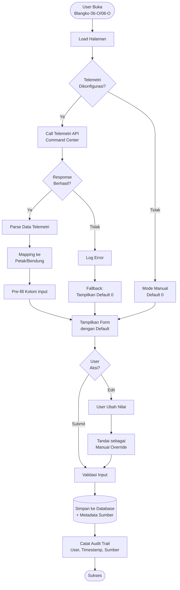
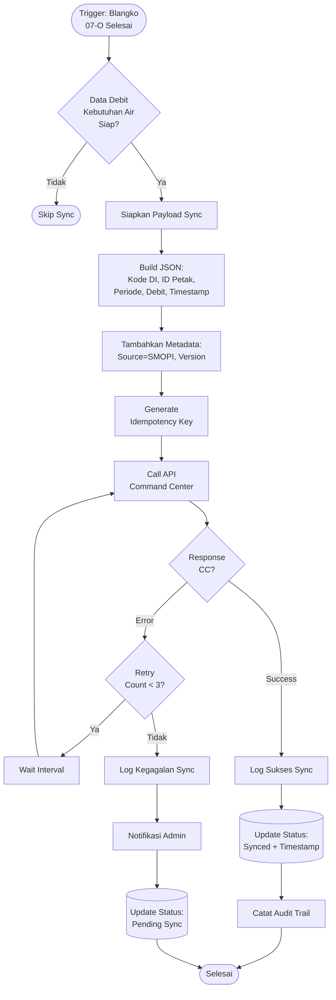

### 5.3 Flowchart Workflow Utama Pengisian Blangko

```mermaid
flowchart TD
  Start([User Login]) --> Auth{Autentikasi\nBerhasil?}
  Auth -->|Tidak| Start
  Auth -->|Ya| CheckRole[Cek Role User]
  
  CheckRole --> Menu[Dashboard/Menu Utama]
  
  Menu --> B01[Blangko 01-O\nRencana Tanam]
  Menu --> B02[Blangko 02-O\nRencana per Mantri]
  Menu --> B04[Blangko 04A-O & 04-O\nUsulan & Realisasi]
  
  B04 --> Fill04A[Isi Keadaan Air\n& Tanaman Usulan]
  Fill04A --> Fill04O[Isi Realisasi\nLuas Tanam]
  Fill04O --> Tele{Telemetri\nTersedia?}
  Tele -->|Ya| AutoFill[Pre-fill dari Telemetri]
  Tele -->|Tidak| ManualFill[Input Manual]
  AutoFill --> Adjust[User Adjust\nJika Perlu]
  ManualFill --> Adjust
  Adjust --> Save04[Simpan Blangko 04-O]
  
  Save04 --> Export{Perlu\nExport?}
  Export -->|PDF| GenPDF[Generate PDF]
  Export -->|Excel| GenXLS[Generate Excel]
  Export -->|Tidak| Next
  GenPDF --> Next
  GenXLS --> Next
  
  Next --> B05[Blangko 05-O\nKebutuhan di Pintu]
  B05 --> AutoCalc[Kalkulasi Otomatis\nQt per Petak]
  AutoCalc --> B06[Blangko 06-O\nPencatatan Debit]
  B06 --> TeleDebit{Telemetri\nDebit?}
  TeleDebit -->|Ya| PreFill06[Pre-fill Debit Harian]
  TeleDebit -->|Tidak| Manual06[Input Manual]
  PreFill06 --> Edit06[User Edit\nJika Perlu]
  Manual06 --> Edit06
  Edit06 --> Save06[Simpan & Hitung\nRata-rata]
  
  Save06 --> B07[Blangko 07-O\nKebutuhan Jaringan]
  B07 --> CalcQb[Kalkulasi Qb\nQt+Ql+Qh-Qs]
  
  CalcQb --> B08[Blangko 08-O\nDebit Sungai]
  B08 --> TeleBend{Telemetri\nBendung?}
  TeleBend -->|Ya| Auto08[Auto dari Telemetri]
  TeleBend -->|Tidak| Man08[Input Manual]
  Auto08 --> Ver08[Verifikasi\nPengamat]
  Man08 --> Ver08
  
  Ver08 --> B09[Blangko 09-O\nFaktor K]
  B09 --> CalcK[Kalkulasi Faktor K\nDebit Diperlukan vs Tersedia]
  
  CalcK --> B10[Blangko 10-O\nLaporan Eksploitasi]
  B10 --> CheckPre{Blangko 04A-09\nLengkap?}
  CheckPre -->|Tidak| Warning[Tampilkan\nPeringatan]
  Warning --> Menu
  CheckPre -->|Ya| Fill10[Isi Data Produksi\n& Statistik]
  Fill10 --> GenReport[Generate Laporan\nPDF]
  
  GenReport --> Sync{Sync ke\nCommand Center?}
  Sync -->|Ya| PushCC[Publish Debit\nKebutuhan Air]
  Sync -->|Tidak| End
  PushCC --> End([Selesai])
```

### 5.4 Flowchart Integrasi Telemetri (Command Center → SMOPI)

```mermaid
flowchart TD
  Start([User Buka\nBlangko 06-O/08-O]) --> LoadPage[Load Halaman]
  LoadPage --> CheckTele{Telemetri\nDikonfigurasi?}
  
  CheckTele -->|Tidak| ManualMode[Mode Manual\nDefault 0]
  CheckTele -->|Ya| CallAPI[Call Telemetri API\nCommand Center]
  
  CallAPI --> APIResp{Response\nBerhasil?}
  APIResp -->|Tidak| LogErr[Log Error]
  LogErr --> Fallback[Fallback:\nTampilkan Default 0]
  
  APIResp -->|Ya| ParseData[Parse Data Telemetri]
  ParseData --> MapData[Mapping ke\nPetak/Bendung]
  MapData --> PreFill[Pre-fill Kolom Input]
  
  PreFill --> Display[Tampilkan Form\ndengan Default]
  Fallback --> Display
  ManualMode --> Display
  
  Display --> UserAction{User\nAksi?}
  UserAction -->|Edit| EditValue[User Ubah Nilai]
  UserAction -->|Submit| Validate
  
  EditValue --> MarkManual[Tandai sebagai\nManual Override]
  MarkManual --> Validate[Validasi Input]
  
  Validate --> SaveDB[(Simpan ke Database\n+ Metadata Sumber)]
  SaveDB --> AuditLog[Catat Audit Trail\nUser, Timestamp, Sumber]
  AuditLog --> Success([Sukses])
```

### 5.5 Flowchart Sinkronisasi Data (SMOPI → Command Center)

```mermaid
flowchart TD
  Start([Trigger: Blangko\n07-O Selesai]) --> CheckData{Data Debit\nKebutuhan Air\nSiap?}
  
  CheckData -->|Tidak| Skip([Skip Sync])
  CheckData -->|Ya| PreparePayload[Siapkan Payload Sync]
  
  PreparePayload --> BuildJSON[Build JSON:\nKode DI, ID Petak,\nPeriode, Debit, Timestamp]
  BuildJSON --> AddMeta[Tambahkan Metadata:\nSource=SMOPI, Version]
  AddMeta --> GenKey[Generate\nIdempotency Key]
  
  GenKey --> CallCC[Call API\nCommand Center]
  CallCC --> CCResp{Response\nCC?}
  
  CCResp -->|Error| Retry{Retry\nCount < 3?}
  Retry -->|Ya| Wait[Wait Interval]
  Wait --> CallCC
  Retry -->|Tidak| LogFail[Log Kegagalan Sync]
  LogFail --> NotifAdmin[Notifikasi Admin]
  NotifAdmin --> MarkPending[(Update Status:\nPending Sync)]
  
  CCResp -->|Success| LogSuccess[Log Sukses Sync]
  LogSuccess --> UpdateStatus[(Update Status:\nSynced + Timestamp)]
  UpdateStatus --> AuditTrail[Catat Audit Trail]
  AuditTrail --> End([Selesai])
  
  MarkPending --> End
```