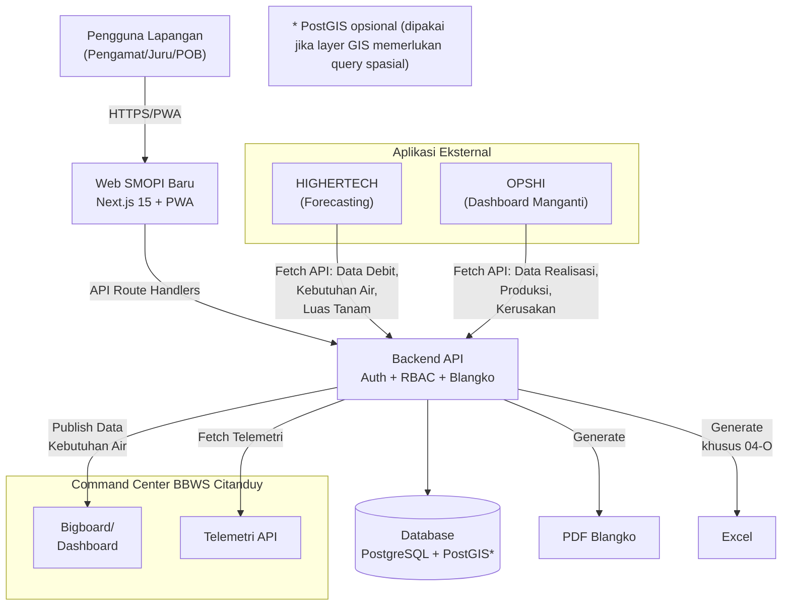

# Proposal Teknis
## Integrasi Command Center BBWS Citanduy dengan SMOPI serta Remake Aplikasi Web SMOPI

PT Keen Optima Solution

Tanggal: 25 Desember 2025

---

## 1. Ringkasan Eksekutif
BBWS Citanduy telah memiliki Command Center (Bigboard dan Dashboard). Namun, hingga saat ini Command Center belum terintegrasi dengan sistem SMOPI sehingga terdapat perbedaan data pada beberapa aspek; salah satu yang paling krusial adalah debit kebutuhan air pada petak tersier. Di sisi lain, aplikasi SMOPI yang berjalan juga menghadapi kendala dari sisi usability (UI/UX), navigasi, performa, keamanan, keterbatasan fitur (mis. export Excel), serta sejumlah bug.

PT Keen Optima Solution mengusulkan:
- Remake aplikasi web SMOPI (perbaikan UI/UX, navigasi, performa, penguatan keamanan, serta perbaikan bug).
- Progressive Web App (PWA) untuk akses mobile yang optimal, memungkinkan instalasi aplikasi di perangkat mobile.
- Integrasi parsial antara SMOPI dan Command Center untuk dataset tertentu, dengan prioritas sinkronisasi debit kebutuhan air pada petak tersier agar angka pada Command Center konsisten dengan SMOPI.
- Integrasi telemetri via API Command Center untuk mengurangi input manual pada blangko yang membutuhkan data debit (telemetri petak tersier dan telemetri bendung), dengan tetap menyediakan mekanisme penyesuaian manual jika telemetri bermasalah.
- Integrasi dengan aplikasi forecasting milik HIGHERTECH dan dashboard OPSHI (Manganti) melalui penyediaan API/endpoint data yang diperlukan. Tim Keen Optima Solution akan melakukan modifikasi kode sumber aplikasi HIGHERTECH dan OPSHI agar menggunakan data dari SMOPI baru.
- Implementasi fitur export Excel (difokuskan pada Blangko 04-O fase 1) dan cetak PDF untuk blangko-blangko lainnya, guna mengurangi beban kerja manual petugas dalam penyiapan laporan.

Aplikasi akan dibangun sebagai aplikasi web menggunakan Next.js 15 (App Router + Server Components) dengan TypeScript 5.6+, serta dioptimalkan sebagai Progressive Web App (PWA) untuk mendukung akses mobile. Target durasi pekerjaan: 1 bulan.

---

## 2. Latar Belakang dan Permasalahan
Bagian ini menjelaskan kondisi eksisting yang menjadi dasar perlunya integrasi antara Command Center BBWS Citanduy dan SMOPI, sekaligus kebutuhan perbaikan aplikasi SMOPI dari sisi data, proses operasional, dan kualitas aplikasi. Fokus utama permasalahan adalah ketidakkonsistenan dataset kritikal (khususnya debit kebutuhan air pada petak tersier), keterbatasan akses telemetri yang berdampak pada input manual, serta hambatan UI/UX, performa, keamanan, dan stabilitas yang mengganggu workflow lapangan.
### 2.1 Kondisi Saat Ini
- Integrasi data SMOPI–Command Center belum tersedia, sehingga terjadi perbedaan angka pada dataset kritikal (terutama debit kebutuhan air pada petak tersier).
- Aplikasi forecasting milik HIGHERTECH dan dashboard OPSHI (Manganti) masih mengonsumsi data dari SMOPI versi lama; kondisi ini menimbulkan inkonsistensi data antar platform dan menyulitkan proses validasi.
- Mekanisme pengambilan data telemetri belum terimplementasi di SMOPI; akibatnya pencatatan debit pada blangko terkait masih bergantung pada input manual dan berpotensi default kosong/0.
- Pengalaman pengguna (UI/UX) belum mendukung workflow operasional: navigasi tidak intuitif, tampilan tabel terpotong pada beberapa perangkat, dan proses pengisian menjadi tidak efisien.
- Kinerja aplikasi belum optimal: waktu muat halaman serta respon interaksi (khususnya pada tabel besar) cenderung lambat.
- Kontrol keamanan aplikasi belum memadai (mis. penguatan akses, proteksi endpoint, dan hardening aplikasi), sehingga meningkatkan risiko akses tidak sah.
- Stabilitas fungsional belum konsisten: terdapat bug pada beberapa menu (mis. detail daftar TMT bangunan tidak tampil, data tidak muncul pada menu tertentu, dan duplikasi navbar).
- Fitur keluaran data masih terbatas: belum tersedia export Excel, sehingga menambah beban kerja operasional dalam penyusunan laporan.

### 2.2 Tujuan
- Mewujudkan konsistensi data antara Command Center dan SMOPI untuk dataset prioritas, khususnya debit kebutuhan air pada petak tersier, melalui kontrak data dan mekanisme sinkronisasi yang dapat diaudit.
- Meningkatkan efektivitas operasional melalui integrasi telemetri (pre-fill) pada blangko terkait, disertai mekanisme fallback/penyesuaian manual untuk menjaga kelancaran operasional saat telemetri bermasalah.
- Meningkatkan kualitas aplikasi dari sisi UI/UX, performa, keamanan, dan stabilitas agar mendukung workflow lapangan serta meminimalkan hambatan saat input dan rekap data.

---

## 3. Ruang Lingkup
### 3.1 In-Scope
- Remake aplikasi web SMOPI menggunakan Next.js 15 (App Router + Server Components) dengan TypeScript.
- Implementasi Progressive Web App (PWA) untuk mendukung:
  - Instalasi aplikasi di perangkat mobile (iOS/Android).
  - Notifikasi push (jika diperlukan).
  - Performa optimal di perangkat mobile.
- Implementasi modul dan blangko sesuai kebutuhan fungsional (Modul 1–14).
- Integrasi parsial SMOPI → Command Center untuk dataset prioritas: debit kebutuhan air pada petak tersier.
- Integrasi telemetri Command Center → SMOPI melalui API untuk:
  - Blangko 06-O (telemetri petak tersier, sebagai default/pre-fill realisasi debit harian).
  - Blangko 08-O (telemetri bendung, debit sungai).
- Integrasi dengan aplikasi eksternal:
  - Aplikasi forecasting milik HIGHERTECH: penyediaan endpoint/API untuk data yang diperlukan, serta modifikasi kode sumber aplikasi HIGHERTECH agar menggunakan SMOPI baru sebagai sumber data.
  - Dashboard OPSHI/Manganti: penyediaan endpoint/API untuk data dashboard, serta modifikasi kode sumber OPSHI agar menggunakan SMOPI baru sebagai sumber data.
- Perbaikan UI/UX (navigasi, tata letak tabel, aksesibilitas), performa, penguatan keamanan (hardening), dan perbaikan bug.
- Export Excel difokuskan pada Blangko 04-O (sesuai kesepakatan fase 1). Untuk blangko lain, fitur keluaran pada fase 1 mengikuti kebutuhan minimal berupa cetak PDF sesuai kebutuhan.

### 3.2 Out-of-Scope (Fase Berikutnya)
- Soil Analyzer (Modul 13) sebagai pengembangan selanjutnya.
- Export Excel untuk blangko lainnya (selain 04-O) jika diperlukan di fase lanjutan.
- Perubahan proses bisnis di Command Center di luar integrasi dataset prioritas.

---

## 4. Asumsi dan Ketergantungan
- Command Center menyediakan telemetri melalui API (kredensial akses, endpoint, dokumentasi, serta pemetaan ID lokasi) dan dapat diakses dari lingkungan SMOPI baru.
- Data master dan referensi yang diperlukan untuk pemetaan petak tersier/bendung (kode DI, ID petak, ID bangunan, ID bendung) tersedia serta dapat disinkronkan/dipetakan.
- Tidak ada modul khusus “sidang komisi”/workflow komisi terpisah di dalam aplikasi; nilai “Keputusan Komisi Irigasi” dikelola sebagai data input yang diisikan oleh pihak berwenang (diasumsikan peran pengamat) sesuai hasil sidang/keputusan yang berlaku.

---

## 5. Gambaran Solusi Teknis
### 5.1 Arsitektur Sistem (Ringkas)
SMOPI baru dibangun sebagai aplikasi web Next.js dengan API backend (Route Handlers) dan database terpusat, dioptimalkan sebagai Progressive Web App (PWA) untuk akses mobile. Integrasi dilakukan ke beberapa arah:

Integrasi dengan Command Center:
- SMOPI → Command Center: publikasi dataset hasil SMOPI (khususnya debit kebutuhan air petak tersier) untuk konsumsi Bigboard/Dashboard.
- Command Center → SMOPI: konsumsi data telemetri via API untuk pre-fill dan efisiensi input.

Integrasi dengan Aplikasi Eksternal:
- SMOPI → HIGHERTECH: menyediakan endpoint/API untuk konsumsi aplikasi forecasting milik HIGHERTECH. Tim Keen Optima Solution akan memodifikasi source code aplikasi HIGHERTECH agar menggunakan data dari SMOPI baru (bukan lagi dari SMOPI lama).
- SMOPI → OPSHI/Manganti: menyediakan endpoint/API untuk konsumsi dashboard OPSHI. Tim Keen Optima Solution akan memodifikasi source code OPSHI agar menggunakan data dari SMOPI baru (bukan lagi dari SMOPI lama).

### 5.2 Diagram Arsitektur Sederhana

### 5.3 Teknologi dan Komponen Utama

Frontend Technology Stack:
- Framework: Next.js 15 (App Router + Server Components)
- Language: TypeScript 5.6+ (strictly typed)
- Styling: Tailwind CSS 4.0 + CSS Modules
- UI Components: shadcn/ui (primary), Headless UI (fallback), custom (last resort)
- Charts: Recharts (default) → D3.js/Observable Plot (untuk visualisasi kompleks)
- Maps: Google Maps JavaScript API + @react-google-maps/api
- Geospatial Operations: @turf/turf untuk operasi buffer, intersect, dll.
- Animations: Framer Motion + Lottie React
- Icons: Lucide React + Heroicons
- PWA: Next-PWA + Workbox

Backend Technology Stack:
- Runtime: Node.js 20+ LTS
- Framework: Next.js 15 Route Handlers (REST API)
- Database: PostgreSQL + Prisma ORM (dengan ekstensi PostGIS untuk data spasial)
- Authentication: NextAuth.js (JWT + Sessions)
- Authorization: Role-based access control (RBAC) untuk 4 role (pengamat, juru, POB utama, POB suplesi)
- Validation: Zod (validasi semua input/output)
- API Documentation: OpenAPI 3.1
- Security: Helmet (untuk microservices terpisah bila ada), CORS, Rate Limiting

Export & Reporting:
- Excel khusus Blangko 04-O menggunakan `exceljs`
- PDF untuk blangko yang mensyaratkan cetak (menggunakan library rendering PDF yang sesuai)

Integrasi:
- Konsumsi API telemetri Command Center
- Publikasi endpoint/kontrak data debit kebutuhan air untuk Bigboard/Dashboard Command Center

---

## 6. Integrasi Data SMOPI–Command Center (Parsial)
### 6.1 Prinsip Integrasi
- Integrasi bersifat parsial (tidak semua dataset disinkronkan).
- Dataset prioritas yang disamakan antara SMOPI dan Command Center:
  - Debit kebutuhan air pada petak tersier (untuk kebutuhan Bigboard/Dashboard).

### 6.2 Kontrak Data Minimal (Usulan)
Agar integrasi tidak melebar, dataset yang dipublikasikan dari SMOPI minimal memuat:
- Identitas:
  - Kode DI / Daerah Irigasi.
  - ID Petak Tersier (atau key mapping yang disepakati).
  - Periode (tanggal/pekan/periode pemberian air) sesuai kebutuhan Bigboard.
- Nilai:
  - Debit kebutuhan air (angka) + satuan.
  - Timestamp publish.
  - Sumber data (SMOPI) dan versi/skema.

### 6.3 Model Konsistensi dan Audit
- Menggunakan model eventual consistency: data di CC akan mengikuti update SMOPI setelah sinkronisasi berjalan.
- Disarankan mekanisme:
  - Idempotency key (menghindari duplikasi update).
  - Retry bila CC tidak dapat menerima update.
  - Pencatatan log sinkronisasi (last sync per periode/DI/petak) untuk audit.

---

## 7. Integrasi Telemetri (Command Center API → SMOPI)
### 7.1 Tujuan
- Mengurangi input manual dan menghindari default 0 untuk:
  - Blangko 06-O (telemetri petak tersier untuk realisasi debit harian).
  - Blangko 08-O (telemetri bendung untuk debit sungai).

### 7.2 Mekanisme Fallback
- Jika telemetri tidak tersedia/rusak/berubah, user tetap dapat mengubah nilai (adjustment) dan sistem menyimpan:
  - Nilai awal dari telemetri.
  - Nilai hasil koreksi manual.
  - Metadata (user, waktu, alasan—opsional) untuk audit.

---

## 8. Integrasi dengan Aplikasi Eksternal

### 8.1 Integrasi HIGERTECH (Forecasting Ketersediaan Air)
Tujuan:
- Menyediakan data SMOPI dari aplikasi baru sebagai sumber untuk aplikasi forecasting ketersediaan air HIGERTECH.

Implementasi:
- Membuat endpoint/API khusus untuk konsumsi HIGERTECH dengan dataset:
  - Data historis debit tersedia (dari Blangko 08-O).
  - Data kebutuhan air per periode (dari Blangko 05-O, 07-O).
  - Data luas tanam dan jenis komoditas (dari Blangko 04-O, 10-O).
- Modifikasi source code HIGERTECH (dilakukan oleh tim Keen Optima Solution) untuk:
  - Mengganti integrasi dari SMOPI lama ke SMOPI baru.
  - Menyesuaikan format data dan endpoint baru.
  - Testing integrasi end-to-end.

### 8.2 Integrasi Dashboard OPSHI/Manganti
Tujuan:
- Menyediakan data SMOPI dari aplikasi baru sebagai sumber untuk visualisasi di dashboard OPSHI/Manganti.

Implementasi:
- Membuat endpoint/API khusus untuk konsumsi dashboard OPSHI dengan dataset:
  - Data realisasi tanam per wilayah dan periode (dari Blangko 10-O).
  - Data debit dan kebutuhan air (dari Blangko 06-O, 07-O, 08-O, 09-O).
  - Data produksi tanaman dan intensitas tanam (dari Blangko 10-O).
  - Data kerusakan tanaman (dari Blangko 04-O, 10-O).
- Modifikasi source code OPSHI (dilakukan oleh tim Keen Optima Solution) untuk:
  - Mengganti integrasi dari SMOPI lama ke SMOPI baru.
  - Menyesuaikan format data dan endpoint baru.
  - Testing integrasi dan visualisasi dashboard.

### 8.3 Prinsip Integrasi
- Semua endpoint integrasi menggunakan RESTful API dengan autentikasi token.
- Data yang dipublikasikan hanya data final/terverifikasi (sesuai dengan business rule yang disepakati).
- Dokumentasi API lengkap menggunakan OpenAPI 3.1.
- Versioning API untuk backward compatibility di masa depan.

---

## 9. Kebutuhan Fungsional (Lengkap)
Bagian ini memuat seluruh requirement fungsional berdasarkan dokumen kebutuhan.

### 9.1 Modul 1 — Authentication dan RBAC
Pekerjaan: Login
- Sistem harus menyediakan fitur login.

Pekerjaan: Tipe user
- Sistem harus menyediakan 4 tipe user: pengamat, juru, POB utama, dan POB suplesi.

### 9.2 Modul 2 — Penugasan User / RBAC
Pekerjaan: Master data (tampilan tabel)
- Sistem harus menampilkan:
  - Id Wilayah Pengamat
  - Wilayah Kerja Pengamat
  - Pengamat
  - Keterangan
  - Luas (Ha)

Pekerjaan: List user management
- Sistem harus menyediakan fitur CRUD untuk pembagian penugasan user yang bisa write oleh pengamat untuk juru, POB utama, dan POB suplesi.

Pekerjaan: List bendung utama
- Sistem menyediakan fitur CRUD untuk bendung utama.

Pekerjaan: List saluran dan bangunan
- Sistem menyediakan fitur CRUD untuk saluran dan bangunan.

### 9.3 Modul 3 — Pengaturan
Pekerjaan: List bendung utama
- Sistem menyediakan fitur CRUD untuk bendung utama.

Pekerjaan: List saluran dan bangunan
- Sistem menyediakan fitur CRUD untuk saluran dan bangunan.

Pekerjaan: List kewenangan bangunan
- Sistem menyediakan fitur untuk menetapkan kewenangan user terhadap data bangunan yang sudah ada.
- Header Informasi Wilayah:
  - Sistem harus menampilkan ringkasan di bagian atas halaman yang memuat Total Luas (Ha) keseluruhan dan nama Pengamat yang bertugas.
- Tabel Hierarki Data (Tree Table):
  - Sistem menampilkan tabel dengan struktur hierarki (Induk-Anak), di mana:
    - Baris Induk (Parent): menampilkan nama Bangunan dan nama Juru yang bertanggung jawab.
    - Baris Anak (Child): menampilkan detail Petak Tersier di bawah bangunan terkait.
- Visualisasi & Agregasi Luas:
  - Sistem harus membedakan visual kolom Luas (Ha) pada baris Induk (mis. diberi warna latar) yang merupakan total penjumlahan luas petak tersier di bawahnya.
  - Baris anak menampilkan luas area spesifik per petak tersier.
- Tombol Aksi & Navigasi:
  - Sistem menyediakan kolom Action yang berisi tombol pintasan pada setiap baris petak tersier, seperti tombol TMT dan Ref Blangko 5 untuk akses cepat.

### 9.4 Modul 4 — Blangko 01-O
Pekerjaan: Form
- Sistem harus menyediakan fitur untuk memilih daerah irigasi dan periode masa tanam.

Pekerjaan: Tabel
- Sistem menampilkan tabel dengan baris Jenis Komoditas dan kolom Masa Tanam (MT1, MT2, MT3).
- Pada setiap Masa Tanam, kolom dibagi menjadi dua sub-kolom berdampingan: Usulan dan Keputusan Komisi Irigasi.
- Sistem menyediakan field input untuk mengisi Luas Tanah Usulan pada setiap Masa Tanam.
- Sistem menampilkan data pada kolom Keputusan Komisi Irigasi.

### 9.5 Modul 5 — Blangko 02-O
Pekerjaan: List blangko
- Sistem harus menyediakan tabel daftar blangko beserta fitur terkait.

Pekerjaan: Master data
- Sistem harus bisa menyimpan dan menampilkan data berikut:
  - Daerah Irigasi
  - No. Kode Irigasi
  - Total Luas Sawah Irigasi
  - Bagian Pelaksana Kegiatan (isian)
  - Perioda Masa Tanam
  - Luas sawah Wil. Ranting/Pengamat
  - Kabupaten

Pekerjaan: Tabel Rencana Tanam per Wilayah Mantri/Juru per Masa Tanam
- Tabel Perbandingan:
  - Sistem menampilkan tabel matriks dengan baris Wilayah Kerja Mantri yang membandingkan dua kelompok data utama secara berdampingan:
    - Usulan IP3A/GP3A.
    - Keputusan Komisi Irigasi.
- Detail Komoditas:
  - Pada kedua kelompok (Usulan & Keputusan), sistem memecah kolom berdasarkan jenis tanaman: Padi, Tebu (Muda/Tua), Palawija, Lain-lain, dan Bero.
- Input Keputusan & Jadwal:
  - Sistem menyediakan kolom input (editable) pada bagian Keputusan Komisi Irigasi.
  - Sistem menyediakan kolom input untuk menentukan Golongan air dan Jadwal Pemberian Air (Tanggal Mulai & Akhir) untuk setiap wilayah.
- Kalkulasi & Validasi:
  - Total Baris: sistem otomatis menghitung kolom Jumlah untuk memastikan sesuai Luas Sawah Irigasi.
  - Total Wilayah: sistem menjumlahkan seluruh data angka dari semua Mantri pada baris Jumlah Areal Kerja Ranting di bagian paling bawah.

### 9.6 Modul 6 — Blangko 04A-O dan 04-O
Pekerjaan: Master data
- Sistem harus bisa menyimpan dan menampilkan data berikut:
  - Daerah Irigasi
  - No. Kode Irigasi
  - Total Luas Wilayah Irigasi
  - Kabupaten
  - Jumlah Petak Tersier
  - Luas Sawah Mantri
  - Perioda Pemberian Air
  - Keputusan Target Areal Tanam per tanaman (Ha)

Pekerjaan: Tabel list blangko 04A-O dan 04-O
- Sistem harus menyediakan tabel daftar blangko beserta fitur terkait.

Pekerjaan: Tabel Keadaan Air dan Tanaman (Usulan / 04A-O)
- Sistem menampilkan tabel matriks dengan Petak Tersier sebagai kolom dan Jenis Tanaman/Keadaan Air sebagai baris.
- Sistem menyediakan editable grid agar pengguna bisa menginput data banyak petak tersier sekaligus dalam satu layar.
- Sistem menyediakan filter untuk memilih Tanggal/Periode Laporan.
- Sistem menyediakan form isian untuk Nama Mantri/Juru yang bertanggung jawab.

Pekerjaan: Tabel Usulan dan Realisasi Luas Tanam (Laporan/Realisasi / 04-O)
- Sistem menampilkan tabel perbandingan antara Luas Usulan dan Luas Realisasi untuk setiap jenis tanaman.
- Pengguna dapat mengisi angka luas lahan yang sudah ditanam pada kolom Realisasi.
- Sistem menyediakan input form keadaan Air irigasi di Petak Tersier dan kerusakan tanaman dalam tabel matriks sederhana:
  - Baris: Padi, Tebu, Palawija.
  - Kolom: Kekeringan; Genangan/Kebanjiran.
  - Input luas kerusakan: input angka (number stepper) per sel.
  - Nilai default: sistem otomatis menampilkan nilai dari telemetri pada semua kolom input untuk mempercepat pengisian, namun tetap dapat diubah manual.
- Sistem menyediakan input form penanggung jawab laporan dan tanggal laporan.
- Sistem menyediakan fitur cetak PDF dan Excel.

### 9.7 Modul 7 — Blangko 05-O
Pekerjaan: Master Data
- Sistem harus bisa menyimpan dan menampilkan data berikut:
  - Daerah Irigasi
  - Nomor Kode DI
  - Total Luas Sawah Irigasi (Ha)
  - Kabupaten
  - Bagian Pelaksana Kegiatan (isian)
  - Kemantren: Jumlah Petak Tersier; Luas Sawah Kemantren
  - Periode Pemberian Air (Tanggal)
  - Daftar Informasi Petak Tersier

Pekerjaan: Tabel Rencana Kebutuhan di Pintu Pengambilan
- Sistem menampilkan tabel besar dengan pengelompokan kolom utama berdasarkan Nama Mantri/Juru.
- Pada setiap kolom Mantri, sistem membagi menjadi dua sub-kolom:
  - Usulan Luas Tanam (Ha)
  - Kebutuhan Air di Sawah (l/det)
- Seluruh sel data tidak dapat diedit (disable input) karena nilai dihasilkan dari kalkulasi backend.
- Sistem menampilkan baris data berdasarkan Jenis Tanaman dan Fase Pertumbuhan untuk Padi, Tebu, Palawija.
- Baris Total & Kesimpulan di bagian bawah memuat:
  - Jumlah di Sawah
  - Kebutuhan Air di Pintu Tersier
  - Kerusakan Tanaman
- Sistem menyediakan form isian tanggal dan informasi penanggung jawab.
- Sistem menyediakan fitur cetak PDF.

### 9.8 Modul 8 — Blangko 06-O
Pekerjaan: Master data
- Sistem harus bisa menyimpan dan menampilkan:
  - Daerah Irigasi
  - No. Kode Irigasi
  - Total Luas Wilayah Irigasi
  - Kabupaten
  - Bagian Pelaksanaan Kegiatan (input)
  - Perioda Masa Tanam
  - Daerah Ranting
  - Daerah Mantri
  - Luas Sawah Mantri

Pekerjaan: Tabel Pencatatan Debit
- Sistem menampilkan tabel dengan hierarki baris berdasarkan Nama Bangunan Kontrol (Bagi/Sadap) dan informasi Petak Tersier terkait.
- Sistem menampilkan kolom debit harian yang pre-filled dari database, namun tetap editable.
- Sistem menghitung ulang Jumlah Debit dan Debit Rata-rata otomatis ketika nilai berubah.
- Sistem menyediakan opsi Cara Pengukuran (radio) default dari database, namun editable.
- Sistem menyediakan opsi Kondisi Alat Ukur (radio) yang bisa diisi user.
- Sistem menyediakan form isian tanggal dan informasi penanggung jawab.
- Sistem menyediakan fitur cetak PDF.

### 9.9 Modul 9 — Blangko 07-O
Pekerjaan: Master Data
- Sistem harus bisa menyimpan dan menampilkan:
  - Daerah Irigasi
  - Nomor Kode DI
  - Jumlah Petak Tersier
  - Total Luas Sawah Irigasi
  - Dinas
  - UPTD
  - Periode Pemberian Air (Tanggal)
  - Daftar Informasi Petak Tersier

Pekerjaan: Tabel List Blangko
- Sistem harus menyediakan tabel daftar blangko.

Pekerjaan: Tabel Rencana Kebutuhan Air di Jaringan Utama dan Penetapan Pemberian Air
- Sistem menampilkan tabel berjenjang (tree view): Mantri/Juru → Bangunan Kontrol → Petak Tersier.
- Sistem menampilkan data referensi (read-only):
  - Luas Sawah Tersier (Ha)
  - Realisasi Debit Periode Lalu (historis rata-rata dan akhir periode)
  - Usulan Luas Tanam (Ha) dari Rencana Tata Tanam (Blangko 01/04)
- Sistem menghitung otomatis Qt pada level petak dan agregasi ke Bangunan/Mantri (Luas Tanam × Faktor Kebutuhan Air/NFR).
- Sistem menyediakan input editable khusus baris rekap Mantri/Juru untuk:
  - Ql (Kebutuhan lain-lain)
  - Qh (Kehilangan air)
  - Qs (Debit suplesi)
- Sistem menghitung otomatis Qb: (Total Qt + Ql + Qh) – Qs.
- Sistem menyediakan kolom Debit Diberikan sebagai hasil akhir alokasi.
- Sistem menyediakan isian tanggal, wilayah, serta informasi terkait juru/pengamat.
- Sistem menyediakan fitur cetak PDF.

### 9.10 Modul 10 — Blangko 08-O
Pekerjaan: Master Data
- Sistem harus bisa menyimpan dan menampilkan:
  - Nama Sungai
  - Nama Bendung
  - Daerah Irigasi
  - Total Luas Sawah Irigasi
  - Kabupaten
  - Daerah Ranting/Pengamat
  - Bagian Pelaksanaan Kegiatan
  - Periode Pemberian Air

Pekerjaan: Tabel list
- Sistem menampilkan tabel list Blangko 08-O per bulan.

Pekerjaan: Detail Blangko 08
- Sistem menampilkan detail tabel pengambilan/pencatatan debit sungai dari telemetri bendung.
- Sistem dapat mencetak Blangko 08.
- Sistem menyediakan fitur verifikasi untuk user pengamat.

### 9.11 Modul 11 — Blangko 09-O
Pekerjaan: Master Data
- Sistem harus bisa menyimpan dan menampilkan:
  - Daerah Irigasi
  - No Kode Irigasi
  - Total Luas Sawah Irigasi
  - Kabupaten
  - Periode Pemberian Air

Pekerjaan: Tabel List
- Sistem menampilkan tabel list Blangko 09-O per periode tiap tahun.
- Sistem menampilkan debit diperlukan (data dari Blangko 07-O) dan telah dikalkulasi.
- Sistem menampilkan debit tersedia (data dari Blangko 08-O) dan telah dikalkulasi.
- Sistem menampilkan debit dialirkan.
- Sistem menampilkan perhitungan faktor K dan telah dikalkulasi.
- Sistem dapat cetak PDF untuk Blangko 09.

### 9.12 Modul 12 — Blangko 10-O
Pekerjaan: Tabel List Blangko
- Sistem menampilkan pesan peringatan bahwa blangko pendahulu (04A s/d 09) wajib selesai sebelum memproses halaman ini.
- Sistem menampilkan list tabel data untuk blangko.

Pekerjaan: Master data
- Sistem harus bisa menyimpan dan menampilkan:
  - Daerah Irigasi
  - No. Kode Irigasi
  - Total Luas Wilayah Irigasi
  - Kabupaten
  - Jumlah Petak Tersier
  - Luas Areal Kerja Ranting/Pengamat
  - Jumlah Mantri/Juru
  - Bagian Pelaks. Kegiatan (isian)

Pekerjaan: Tabel Realisasi Tanam dan Keadaan Air
- Sistem menampilkan tabel baris waktu Oktober s/d September dibagi Periode 1 dan 2.
- Kolom dikelompokkan: Padi (MT1–3), Palawija (MT1–3), Tebu, Lain-lain.
- Sistem menampilkan data luas tanam (Ha) hasil rekap input periode sebelumnya (read-only).
- Sistem menampilkan kolom Bero dihitung: total luas baku – total luas tanam.
- Sistem menampilkan kolom data hidrologi untuk setiap periode:
  - Debit Tersedia: total debit, debit pengambilan, Q limpas bendung.
  - Faktor Koreksi: kehilangan air, Q suplesi.
  - Kebutuhan Air: kebutuhan di tersier, kebutuhan lain-lain.
  - Analisa: faktor K rata-rata, debit rencana, neraca air.

Pekerjaan: Tabel Statistik, Kerusakan, Rencana Tanam
- Sistem menghitung dan menampilkan puncak luas tanam dan intensitas tanam (%) otomatis.
- Sistem menampilkan rekap data kerusakan (kekeringan/banjir) per jenis tanaman (data dari laporan sebelumnya/Blangko 07).
- Sistem menyediakan input editable untuk Rencana YAD.
- Sistem menampilkan data Rencana Tanam Tahun Ini sebagai referensi (read-only).

Pekerjaan: Tabel Produksi Tanaman
- Sistem mengambil puncak luas tanam dari tabel statistik sebagai basis.
- Sistem menyediakan input editable Data Ubinan/Rata-rata Produksi (Ton/Ha).
- Sistem menghitung otomatis produksi per tanaman: puncak luas tanam × data ubinan.
- Sistem menjumlahkan seluruh produksi menjadi total jumlah produksi (Ton) di baris bawah.

Pekerjaan: Laporan
- Sistem mendukung fitur cetak PDF.
- Sistem menyediakan form isian tanggal dan informasi terkait pengamat/ranting.

### 9.13 Modul 13 — Soil Analyzer (Pengembangan Selanjutnya)
- Sistem bisa otomatis mendeteksi genangan/kebanjiran atau kekeringan (merujuk Blangko 04-O).

### 9.14 Modul 14 — Peta Visualisasi Petak Tersier dan Pintu Air
- Sistem menampilkan peta untuk memvisualisasikan petak tersier dan pintu air menggunakan data GIS yang ada.

---

## 10. Kebutuhan Non-Fungsional (Mengacu Tantangan)
### 10.1 UI/UX dan Usability
- Progressive Web App (PWA) untuk akses optimal di perangkat mobile.
- Responsive design yang adaptif untuk berbagai ukuran layar.
- Navigasi sederhana dan konsisten.
- Tabel input tidak terpotong; mendukung layar lapangan.
- User role juru dapat menjalankan workflow utama tanpa kebingungan.

### 10.2 Performa
- Optimasi load data untuk tabel besar (pagination/virtualization).
- Respons cepat pada input grid (khusus 04A/04-O).
- PWA caching untuk performa optimal.

### 10.3 Keamanan
- RBAC konsisten di UI dan API.
- Proteksi terhadap akses tanpa kewenangan.
- Logging aktivitas penting (login, perubahan data kritikal).
- Secure API endpoints untuk integrasi eksternal (aplikasi HIGHERTECH, OPSHI).

### 10.4 Stabilitas dan Bugfix
- Perbaikan bug yang sudah teridentifikasi (detail TMT bangunan tidak muncul, duplikasi navbar, halaman list/detail tertentu).

---

## 11. Rencana Pengerjaan (1 Bulan)
### Minggu 1 — Fondasi & Desain
- Finalisasi scope, mapping data petak tersier/bendung, dan kontrak integrasi dataset kebutuhan air.
- Setup arsitektur Next.js, struktur modul, dan RBAC.
- Desain UI/UX untuk alur input utama blangko dengan optimasi mobile/PWA.

### Minggu 2 — Implementasi Modul Inti & Blangko Prioritas
- Implement modul authentication + RBAC (4 role).
- Implement modul penugasan + pengaturan (kewenangan bangunan/tree table).
- Implement Blangko 04A-O & 04-O (editable grid, filter periode).

### Minggu 3 — Integrasi Telemetri + Export Excel (04-O)
- Integrasi telemetri API untuk Blangko 06-O (debit harian petak tersier) dan 08-O (debit sungai bendung).
- Implement export Excel khusus Blangko 04-O.
- Implement cetak PDF sesuai kebutuhan blangko terkait.

### Minggu 4 — Integrasi Eksternal, Hardening, UAT, Handover
- Implement publikasi dataset debit kebutuhan air petak tersier untuk Bigboard/Dashboard.
- Implement endpoint API untuk integrasi aplikasi HIGHERTECH dan OPSHI.
- Modifikasi source code aplikasi HIGHERTECH dan OPSHI untuk integrasi dengan SMOPI baru.
- Setup dan konfigurasi PWA (service worker, manifest).
- Hardening security dan optimasi performa.
- UAT dengan stakeholder, perbaikan bug, finalisasi dokumentasi.

---

## 12. Deliverables
- Aplikasi web SMOPI (remake) dengan modul dan blangko sesuai scope.
- Progressive Web App (PWA) yang dapat diinstall di perangkat mobile.
- Integrasi telemetri (Command Center API → SMOPI) untuk blangko terkait.
- Integrasi dataset kebutuhan air petak tersier (SMOPI → Command Center).
- Integrasi dengan aplikasi HIGHERTECH: endpoint API dan modifikasi source code aplikasi HIGHERTECH.
- Integrasi dengan OPSHI/Manganti: endpoint API dan modifikasi source code OPSHI.
- Fitur cetak PDF untuk blangko yang mensyaratkan.
- Export Excel untuk Blangko 04-O.
- Dokumen:
  - Diagram arsitektur & data flow (termasuk integrasi eksternal).
  - Matriks role & akses.
  - Kontrak integrasi dataset kebutuhan air.
  - Dokumentasi API (OpenAPI 3.1) untuk integrasi aplikasi HIGHERTECH dan OPSHI.
  - Panduan penggunaan aplikasi (web dan mobile/PWA).

---

## 13. Risiko dan Mitigasi
- Risiko: Pemetaan ID petak tersier/bendung tidak konsisten antar sistem.
  - Mitigasi: definisikan mapping table dan lakukan validasi awal (sampling) sebelum UAT.
- Risiko: Telemetri API tidak stabil atau data tidak lengkap.
  - Mitigasi: fallback manual adjustment + pencatatan sumber data.
- Risiko: Scope blangko sangat luas untuk 1 bulan.
  - Mitigasi: prioritisasi workflow inti (04A/04-O, 06-O, 08-O, integrasi kebutuhan air), dan fasekan fitur non-kritis.
- Risiko: Akses ke source code aplikasi HIGHERTECH dan OPSHI terbatas atau dokumentasi kurang.
  - Mitigasi: koordinasi awal dengan tim pemilik aplikasi, request akses repository dan dokumentasi teknis sebelum minggu ke-4.
- Risiko: Ketergantungan pada fitur browser untuk PWA (terutama iOS Safari).
  - Mitigasi: testing menyeluruh di berbagai platform, fallback ke web app standar jika PWA tidak didukung penuh.

---

## 14. Penutup
Proposal ini disusun untuk menjawab kebutuhan utama BBWS Citanduy, yaitu: (1) memastikan konsistensi data prioritas antara SMOPI dan Command Center, khususnya debit kebutuhan air pada petak tersier; (2) meningkatkan kualitas aplikasi SMOPI melalui remake aplikasi web yang lebih mudah digunakan, lebih cepat, lebih aman, dan lebih stabil; (3) menyediakan akses mobile yang optimal melalui Progressive Web App (PWA); serta (4) mendukung integrasi dengan aplikasi eksternal (forecasting HIGHERTECH dan dashboard OPSHI/Manganti) guna membentuk ekosistem pengelolaan sumber daya air yang lebih terintegrasi.
